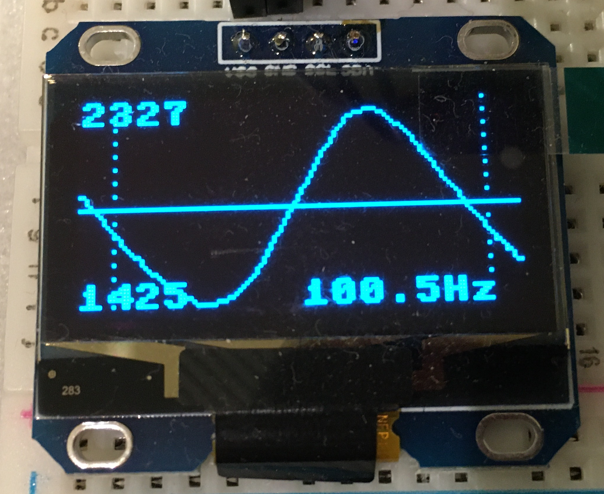
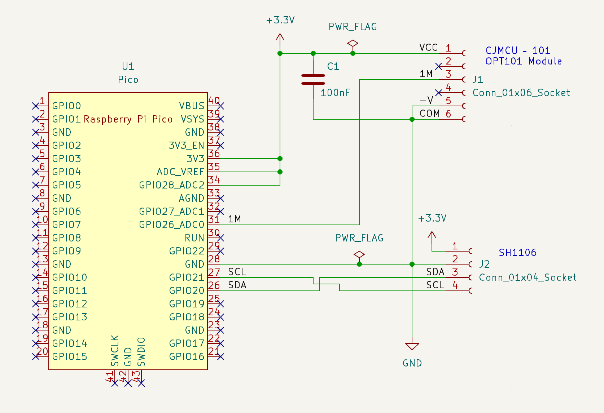
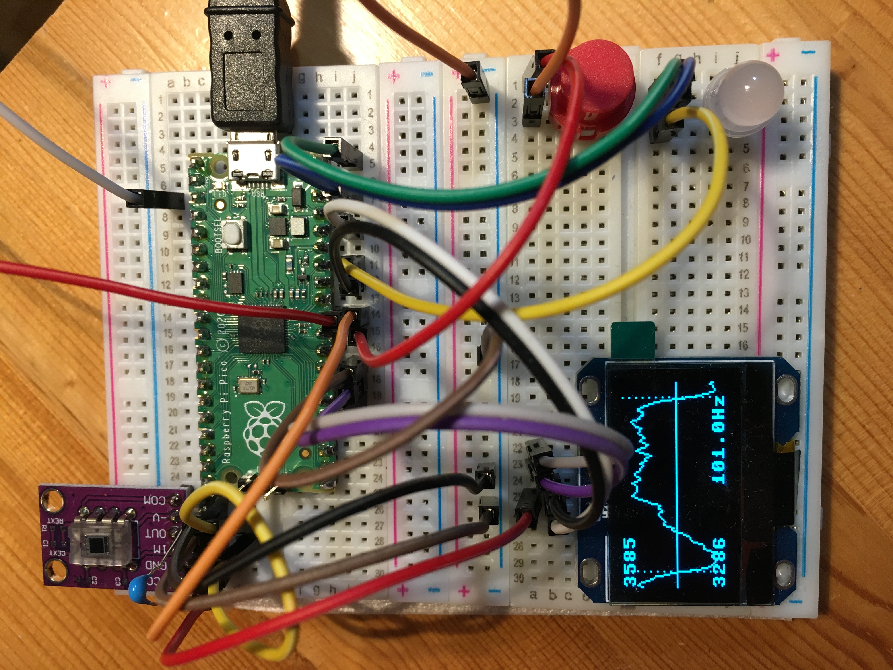

# flickertester
Using RaspberryPi Pico to visualize flicker of LED lamps

A small project for visualizing the flicker of LED lamps on a display. On the left side the minimum and maximum measured brightness value is shown, on the lower right side the calculated flicker frequency in Hertz.

Implementation is done in MicroPython on a RaspberryPi Pico using a CJMCU breakout board for the OPT101 light sensor and a SH1106 OLED display; both are available in the usual maker shops.

The analogue output value of the OPT101 is digitized by the Pico which shows the waveform on the display. Implementation is quite crude; more a proof-of-concept than a "real" device.

**Circuit**

**Breadboard**

**References**
SH1106 driver: https://github.com/robert-hh/SH1106
OPT101 circuit: https://www.electroschematics.com/photodiode/
DMA code borrowed from https://iosoft.blog/2021/10/26/pico-adc-dma/
